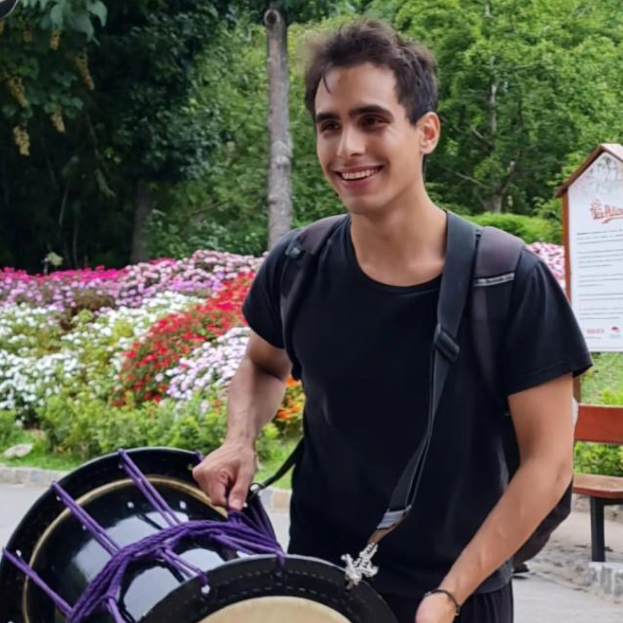

# Presentación :handshake:

## Sobre mí
Me llamo **Ariel Iván Arellano**.

Legajo: 176.214-0.

Técnico en computación del secundario, Estudiante de Ingeniería en Sistemas, DevOps. Agnóstico del `git rebase`. Team invierno y dark theme. Helado de pistacho el mejor sabor.

### Hobbies 
50% Otaku
- Taiko en Buenos Aires Taiko :drum:
- Japonés N4  
- Poniéndome al día con One Piece (skypea)
- A veces escribo reviews.

20% Jueguitos
- Lolero retirado esperando el remake del Oblivion.
- AoE2 enjoyer.
- Jueguitos rítmicos.

15% Deporte
- Voy al gimnasio
- Tengo que retomar boulder. Montaña > Playa.

10% Música
- Los jueguitos rítmicos definieron mis gustos musicales.
- A veces salgo a bailar.

5% Pelis
- Con los pibes del Discord cuando tienen ganas. 
- Buenas pelis las del spiderverse

### Carrera y Estudios
Recibido Técnico en Computación del secundario 2019.

Arranco la Facu 2020 y me agarra la pandemia.

La dejo en pausa y arranco a hacer freelance con un amigo.

Un poquito de FE, un poquito de BE. Conozco una pipeline y me enamoro.

Conozco la IaC y me sorprendo.

Retomo la facultad en 2024.

Consigo trabajo como DevOps.

